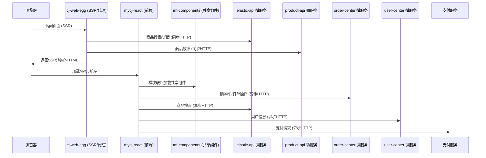
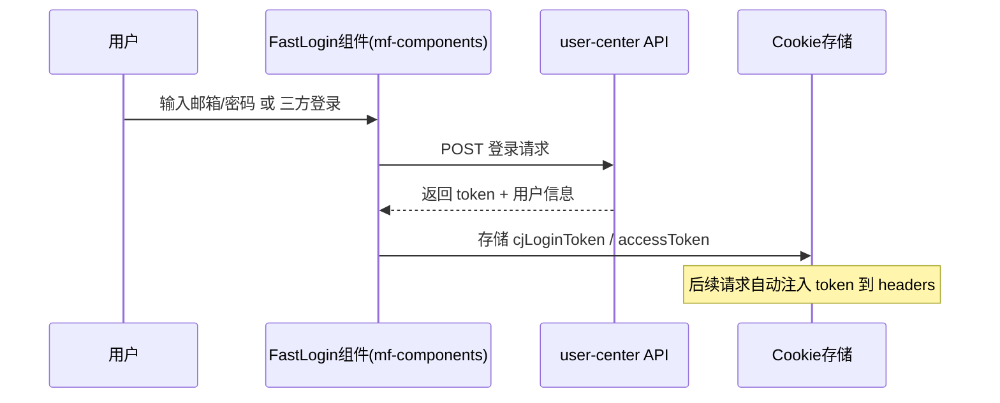
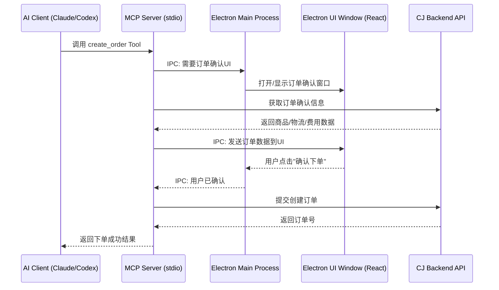

# CJMCPAPP Electron + MCP Server 执行计划

> 生成时间：26年05月13日  
> 提交人：东咸  
> 来源项目：cj-web-egg、mf-components、mycj-react

---

## 一、现有调用链路分析（前置核心）

### 1.1 整体架构说明

CJ商城由三个项目协同运作：
| 项目 | 角色 | 技术栈 |
|------|------|--------|
| **cj-web-egg** | SSR 服务端 + API 代理层 | Egg.js + React SSR |
| **mf-components** | 微前端共享组件库（Monorepo） | React 16 + Webpack Module Federation |
| **mycj-react** | 用户中心前端（MyCJ） | React + Umi 3 + TypeScript |

### 1.2 API 调用链路



### 1.3 认证链路



### 1.4 核心 API 端点梳理

| 功能域 | 微服务 | 关键端点 | 方法 |
|--------|--------|----------|------|
| **商品搜索** | elastic-api | `/product/v4/search`, `/product/v5/search` | POST |
| **商品详情** | elastic-api | `/cjProductInfo/v2/getProductDetail` | POST |
| **推荐搜索** | elastic-api | `/recommend/search/productDetail/queryPage` | POST |
| **购物车-查询** | order-center | `/proxyOrder/product/productList` | POST |
| **购物车-添加** | order-center | (addCart API) | POST |
| **下单** | order-center | `/proxyOrder/saveOrder/manualCreateOrderV2` | POST |
| **订单查询** | order-center | 多个状态查询端点 | POST |
| **支付** | app | `/pay/pay` | POST |
| **用户信息** | userCenterForeignWeb | 多个用户端点 | POST |

### 1.5 请求公共参数

每个请求需携带：
- `token`: 从 Cookie `cjLoginToken` 获取
- `accessToken`, `serviceToken`: 认证令牌
- `platform`: 平台标识 (1=MyCJ, 2=OwnCJ, 3=Affiliate)
- `cj-area`: 区域代码
- `language`: 语言标识
- `currency`: 货币标识

---

## 二、MCP Tools 全域清单（按业务域分类）

### 2.1 商品域 MCP Tools

| Tool 名称 | 描述（MCP description） | 端点 | 操作类型 | 优先级 |
|-----------|------------------------|------|---------|--------|
| `search_products` | 根据关键词、分类、价格范围搜索CJ商品，返回商品列表含名称、价格、图片、SKU等信息 | `POST elastic-api/product/v5/search` | ✅ READ | P0 |
| `get_product_detail` | 根据商品ID或SKU获取商品详细信息，包含价格、库存、变体、图片、描述等 | `POST elastic-api/cjProductInfo/v2/getProductDetail` | ✅ READ | P0 |
| `get_product_recommendations` | 根据商品ID获取相关推荐商品列表 | `POST elastic-api/recommend/search/productDetail/queryPage` | ✅ READ | P1 |
| `get_trending_products` | 获取趋势商品列表，支持分类和时间范围筛选 | `POST elastic-api/product/trendSearch` | ✅ READ | P1 |
| `search_products_by_image` | 通过上传图片搜索相似商品 | `POST elastic-api/product/v1/searchUpload` | ✅ READ | P2 |
| `get_my_products` | 获取我的商品列表，支持分页和筛选 | `POST elastic-api/myProduct/productPage` | ✅ READ | P1 |
| `get_sku_assignments` | 获取SKU分配和可见性信息 | `POST product-api/assign/getAssignAndVisibility` | ✅ READ | P2 |

### 2.2 仓库/全球仓域 MCP Tools

| Tool 名称 | 描述（MCP description） | 端点 | 操作类型 | 优先级 |
|-----------|------------------------|------|---------|--------|
| `get_warehouse_list` | 获取可用仓库列表，包含仓库名称、区域、服务类型等信息 | `POST storehouse-center-api/areaInfo/getCountryByAreaId` | ✅ READ | P0 |
| `get_warehouse_store_list` | 获取仓库库存列表，支持按仓库和商品筛选 | `POST order-center/proxyOrder/warehouse/getWarehouseStoreListV2` | ✅ READ | P0 |
| `get_warehouse_cost_range` | 获取仓库费用明细（入库费、仓储费、出库费），用于成本分析 | `POST storehouse-center-api/store/goods/cost/getWarehouseCostRange` | ✅ READ | P0 |
| `get_warehouse_info` | 获取仓库详细信息列表 | `POST storehouse-center-api/areaInfo/getStorehouseInfoList` | ✅ READ | P1 |
| `check_us_warehouse` | 检查商品是否符合美国仓发货条件 | `POST order-center/proxyOrder/warehouse/checkCanUSWarehouse` | ✅ READ | P1 |
| `query_cj_warehouse_address` | 查询CJ仓库地址信息，用于物流路线规划 | `POST cj-platform-web/shop/logistics/queryCjWarehouseAddress` | ✅ READ | P2 |

### 2.3 购物车域 MCP Tools

| Tool 名称 | 描述（MCP description） | 端点 | 操作类型 | 优先级 |
|-----------|------------------------|------|---------|--------|
| `get_cart_list` | 获取购物车商品列表，含价格、数量、物流信息 | `getCartList API` | ✅ READ | P1 |
| `add_to_cart` | 将商品添加到购物车，需指定变体ID和数量 | `addCart API` | ⚠️ WRITE | P1 |
| `update_cart_item` | 更新购物车商品数量或物流方式 | `queryCartProduct API` | ⚠️ WRITE | P1 |
| `remove_cart_item` | 删除购物车中的指定商品 | `deleteCartInvalidProduct API` | ⚠️ WRITE | P2 |
| `get_cart_summary` | 获取购物车统计信息（总件数、总金额） | `getTotalOrderInfo API` | ✅ READ | P1 |

### 2.4 订单域 MCP Tools

| Tool 名称 | 描述（MCP description） | 端点 | 操作类型 | 优先级 |
|-----------|------------------------|------|---------|--------|
| `get_order_list` | 查询订单列表，支持按状态（待支付/待发货/已完成/已取消）筛选 | 多个状态查询端点 | ✅ READ | P0 |
| `get_order_detail` | 获取订单详细信息，含商品、物流、支付状态 | `getOrderDetailV2 API` | ✅ READ | P0 |
| `create_order` | 创建订单（需Electron UI确认页面） | `POST order-center/proxyOrder/saveOrder/manualCreateOrderV2` | ⚠️ WRITE | P1 |
| `cancel_order` | 取消订单（需用户确认） | `cancelOrder API` | ⚠️ WRITE | P1 |
| `reorder` | 再来一单，基于历史订单重新下单 | `createAgainOrder API` | ⚠️ WRITE | P2 |
| `get_order_confirm_info` | 获取订单确认页信息（用于Electron UI展示） | `listOrderConfirm API` | ✅ READ | P1 |
| `get_order_logistics` | 获取订单物流追踪信息 | `getOrderLogisticsDetailV2 API` | ✅ READ | P1 |
| `get_shipping_methods` | 获取可用物流方式和运费 | `getWuLiuList API` | ✅ READ | P1 |

### 2.5 纠纷域 MCP Tools

| Tool 名称 | 描述（MCP description） | 端点 | 操作类型 | 优先级 |
|-----------|------------------------|------|---------|--------|
| `get_dispute_list` | 查询纠纷列表，支持分页和状态筛选 | `POST cjorder-web/disputeNew/getNewDisputeList` | ✅ READ | P1 |
| `get_dispute_count` | 获取各状态纠纷数量统计 | `POST cjorder-web/disputeNew/getNewDisputeCount` | ✅ READ | P1 |
| `get_dispute_detail` | 获取纠纷详情，含协商历史 | `POST cjorder-web/disputeNew/getNewDisputeDetailInfo` | ✅ READ | P1 |
| `get_dispute_messages` | 获取纠纷协商聊天记录 | `POST cjorder-web/disputeNew/getDisputeMessage` | ✅ READ | P1 |
| `create_dispute` | 发起纠纷（需Electron UI发起页面） | `POST cjorder-web/disputeNew/openNewDispute` | ⚠️ WRITE | P1 |
| `reply_dispute` | 回复纠纷协商 | `POST cjorder-web/disputeNew/replyDisputeNew` | ⚠️ WRITE | P2 |
| `cancel_dispute` | 取消纠纷（需用户确认） | `POST cjorder-web/disputeNew/cancelNewDispute` | ⚠️ WRITE | P2 |
| `agree_reissue` | 同意补发（需用户确认） | `POST cjorder-web/disputeNew/agreeReissueOrderNew` | ⚠️ WRITE | P2 |

### 2.6 库存域 MCP Tools

| Tool 名称 | 描述（MCP description） | 端点 | 操作类型 | 优先级 |
|-----------|------------------------|------|---------|--------|
| `get_private_inventory` | 获取私有库存列表，按仓库和商品维度查看 | `POST api/privateInventory/querySpuPagePc` | ✅ READ | P1 |
| `get_inventory_variants` | 获取库存商品的变体详情 | `POST api/privateInventory/querySkuListByProductIdPc` | ✅ READ | P1 |
| `get_inventory_flow` | 获取库存流水记录（入库/出库/调拨） | `POST api/privateInventory/querySkuFlowByConditionPc` | ✅ READ | P1 |
| `get_deposit_inventory` | 获取预存库存列表 | `POST cjorder-web/depositInventory/list` | ✅ READ | P2 |
| `get_cj_authority_inventory` | 获取CJ自有库存信息 | `POST product-api/pojo/inventory/getCjAuthorityList` | ✅ READ | P2 |
| `export_inventory` | 导出库存数据为文件 | `POST api/privateInventory/exportPc` | ✅ READ | P2 |

### 2.7 搜品/采购域 MCP Tools

| Tool 名称 | 描述（MCP description） | 端点 | 操作类型 | 优先级 |
|-----------|------------------------|------|---------|--------|
| `get_sourcing_list` | 获取搜品/采购需求列表 | `POST quick-search-product-center/source/sourcing/pageSource` | ✅ READ | P1 |
| `get_sourcing_count` | 获取搜品需求数量统计 | `POST quick-search-product-center/source/sourcing/sourceCount` | ✅ READ | P1 |
| `create_sourcing_request` | 提交搜品/采购需求（需用户确认） | `POST source-rest-api/newSource/sourcing/addSource` | ⚠️ WRITE | P1 |
| `get_sourcing_template` | 获取批量搜品上传模板 | `POST quick-search-product-center/source/sourcing/template` | ✅ READ | P2 |

### 2.8 刊登域 MCP Tools

| Tool 名称 | 描述（MCP description） | 端点 | 操作类型 | 优先级 |
|-----------|------------------------|------|---------|--------|
| `get_shop_products` | 获取店铺已刊登的商品列表 | `POST cj-platform-web/product/shopProductNew` | ✅ READ | P1 |
| `get_product_associations` | 获取商品关联关系 | `POST cj-platform-web/product/relevance/queryPageOld` | ✅ READ | P2 |
| `pull_platform_product` | 从平台拉取商品到CJ（需用户确认） | `POST cj-platform-web/product/pullPlatformProduct` | ⚠️ WRITE | P2 |
| `get_pull_progress` | 查询商品拉取进度 | `POST cj-platform-web/product/queryPullProgress` | ✅ READ | P2 |
| `batch_pack_products` | 批量商品打包（需用户确认） | `POST cj-platform-web/productPack/batchPack` | ⚠️ WRITE | P2 |

### 2.9 COGS成本分析域 MCP Tools

| Tool 名称 | 描述（MCP description） | 端点 | 操作类型 | 优先级 |
|-----------|------------------------|------|---------|--------|
| `get_warehouse_cost` | 获取仓库服务费用明细（入库/仓储/出库） | `POST storehouse-center-api/store/goods/cost/getStorehouseCost` | ✅ READ | P0 |
| `get_order_invoice` | 获取订单发票/费用明细，用于成本核算 | `POST payment-center-web/orderInvoice/getOrderInvoiceInfo` | ✅ READ | P0 |
| `get_variant_tiered_pricing` | 获取商品变体阶梯价格，用于批量采购成本分析 | `POST erp/PackProduct/getVariantDiscountPrice` | ✅ READ | P0 |
| `get_logistics_pricing` | 获取物流阶梯价格，用于运费成本分析 | `POST cujia-logistics-freight/freight/logistics/getLogisticsDiscountPrice/v4` | ✅ READ | P0 |
| `get_wallet_invoice` | 获取钱包发票/交易流水 | `POST payment-center-web/orderInvoice/getWalletInvoiceInfo` | ✅ READ | P1 |
| `get_supplier_invoice` | 获取供应商发票信息 | `POST payment-center-web/orderInvoice/getSupplier` | ✅ READ | P1 |
| `export_order_invoice` | 导出订单发票数据 | `POST payment-center-web/orderInvoice/orderInvoiceExport` | ✅ READ | P2 |

### 2.10 用户认证域 MCP Tools

| Tool 名称 | 描述（MCP description） | 端点 | 操作类型 | 优先级 |
|-----------|------------------------|------|---------|--------|
| `user_login` | 用户登录（在Electron UI窗口中完成，支持邮箱密码和三方登录） | FastLogin 流程 | ⚠️ WRITE | P0 |
| `user_logout` | 用户登出，清除本地token | 本地操作 | ⚠️ WRITE | P1 |
| `get_login_status` | 检查当前登录状态和token有效性 | 本地检查 | ✅ READ | P0 |
| `get_user_info` | 获取当前登录用户信息 | `userCenterForeignWeb API` | ✅ READ | P1 |

### 2.11 支付域 MCP Tools

| Tool 名称 | 描述（MCP description） | 端点 | 操作类型 | 优先级 |
|-----------|------------------------|------|---------|--------|
| `pay_order` | 支付订单（在Electron UI窗口中完成确认） | `POST app/pay/pay` | ⚠️ WRITE | P2 |
| `query_payment_status` | 查询支付状态 | `tradeQuery API` | ✅ READ | P2 |

---

## 三、MCP Tools 统计

| 分类 | READ (安全) | WRITE (需确认) | 合计 |
|------|------------|---------------|------|
| 商品域 | 7 | 0 | 7 |
| 仓库域 | 6 | 0 | 6 |
| 购物车域 | 2 | 3 | 5 |
| 订单域 | 5 | 3 | 8 |
| 纠纷域 | 4 | 4 | 8 |
| 库存域 | 5 | 1 | 6 |
| 搜品域 | 3 | 1 | 4 |
| 刊登域 | 3 | 2 | 5 |
| COGS成本 | 7 | 0 | 7 |
| 认证域 | 2 | 2 | 4 |
| 支付域 | 1 | 1 | 2 |
| **合计** | **45** | **17** | **62** |

---

## 四、Electron UI 交互页面规划（关键操作确认 + 复杂展示）

需要 Electron 渲染进程（React）提供 UI 界面的场景：

| 页面 | 触发方式 | 功能 | 优先级 |
|------|---------|------|--------|
| **登录页** | `user_login` Tool 调用时弹出 | 邮箱/密码输入 + 三方登录按钮 + 验证码 | P0 |
| **订单确认页** | `create_order` Tool 调用时弹出 | 展示商品明细、收货地址、物流方式、费用汇总，用户点击确认下单 | P1 |
| **纠纷发起页** | `create_dispute` Tool 调用时弹出 | 选择纠纷商品、原因类型、上传凭证图片、填写描述 | P1 |
| **支付确认页** | `pay_order` Tool 调用时弹出 | 展示支付金额、选择支付方式、确认支付 | P2 |
| **搜品提交页** | `create_sourcing_request` Tool 调用时弹出 | 填写搜品需求、上传参考图片 | P2 |

**技术方案**：
- MCP Tool 检测到需要 UI 交互时，通过 IPC 通知 Electron 主进程
- 主进程创建/显示 BrowserWindow 加载对应 React 页面
- 用户在 UI 完成操作后，结果通过 IPC 返回 MCP Tool
- MCP Tool 继续执行后续 API 调用



---

## 五、QPS 限速方案

### 5.1 限速策略

| 级别 | Tool 类型 | QPS 限制 | 说明 |
|------|----------|---------|------|
| **Level 1** | READ 查询类 | 10 QPS | 搜索、列表查询、详情查看 |
| **Level 2** | WRITE 操作类 | 2 QPS | 加购、下单、发起纠纷 |
| **Level 3** | 支付/关键操作 | 1 QPS | 支付、取消订单、同意补发 |
| **全局** | 所有请求合计 | 20 QPS | 防止AI并发调用过多接口 |

### 5.2 实现方案

```
src/api-client/
├── rate-limiter.ts         # 令牌桶限速器
├── http-client.ts          # Axios 实例（集成限速拦截器）
└── endpoints.ts            # 端点常量（含QPS级别标注）
```

- 使用**令牌桶算法**实现限速
- 在 Axios 请求拦截器中集成限速检查
- 超出 QPS 时排队等待，不直接拒绝
- 每个 API 端点标注所属 QPS 级别
- 提供 Tool 级别的调用频率统计（可通过 `get_rate_limit_status` Tool 查询）

---

## 六、Codex 集成方案

### 6.1 Codex 可用场景

| 场景 | 对应 MCP Tools | 说明 |
|------|---------------|------|
| **商品分析** | `search_products` + `get_product_detail` + `get_variant_tiered_pricing` | 批量搜索商品并分析价格趋势、变体分布 |
| **刊登管理** | `get_shop_products` + `get_product_associations` + `pull_platform_product` | 自动化商品刊登和关联管理 |
| **搜品优化** | `search_products` + `search_products_by_image` + `create_sourcing_request` | AI辅助搜品和需求提交 |
| **库存监控** | `get_private_inventory` + `get_inventory_flow` + `get_deposit_inventory` | 实时库存监控和预警 |
| **订单追踪** | `get_order_list` + `get_order_detail` + `get_order_logistics` | 批量订单状态追踪和异常检测 |
| **COGS成本分析** | `get_warehouse_cost` + `get_order_invoice` + `get_variant_tiered_pricing` + `get_logistics_pricing` | 全链路成本核算：商品成本+仓储费+物流费 |

### 6.2 Codex 使用的 MCP 配置

```json
{
  "mcpServers": {
    "cj-dropshipping": {
      "command": "node",
      "args": ["path/to/CJMCPAPP/dist/mcp-server/index.js"],
      "env": {
        "CJ_API_BASE": "https://www.cjdropshipping.com",
        "CJ_TOKEN": "从electron-store读取"
      }
    }
  }
}
```

---

## 七、项目目录结构

```
CJMCPAPP/
├── package.json
├── tsconfig.json
├── .env.example                    # 环境变量模板（不含密钥）
├── .gitignore
├── electron-builder.config.js
├── docs/
│   └── MCP-App前端接口和API整合/
├── tmp/
├── 测试结果/
├── src/
│   ├── main/                       # Electron 主进程
│   │   ├── index.ts
│   │   ├── window.ts               # 窗口管理（登录/确认等UI窗口）
│   │   └── ipc.ts                  # IPC 通信桥接
│   ├── renderer/                   # Electron 渲染进程（React UI）
│   │   ├── pages/
│   │   │   ├── login/              # 登录页（邮箱+三方登录）
│   │   │   ├── order-confirm/      # 订单确认页
│   │   │   ├── dispute-create/     # 纠纷发起页
│   │   │   ├── payment-confirm/    # 支付确认页
│   │   │   └── sourcing-submit/    # 搜品提交页
│   │   ├── components/             # 共享UI组件
│   │   └── App.tsx
│   ├── mcp-server/                 # MCP Server 核心
│   │   ├── index.ts                # 入口 (stdio transport)
│   │   ├── server.ts               # Server 实例 + Tool 注册
│   │   ├── tools/                  # 62个 MCP Tools
│   │   │   ├── product/            # 商品域 (7个)
│   │   │   ├── warehouse/          # 仓库域 (6个)
│   │   │   ├── cart/               # 购物车域 (5个)
│   │   │   ├── order/              # 订单域 (8个)
│   │   │   ├── dispute/            # 纠纷域 (8个)
│   │   │   ├── inventory/          # 库存域 (6个)
│   │   │   ├── sourcing/           # 搜品域 (4个)
│   │   │   ├── listing/            # 刊登域 (5个)
│   │   │   ├── cost-analysis/      # COGS成本域 (7个)
│   │   │   ├── auth/               # 认证域 (4个)
│   │   │   └── payment/            # 支付域 (2个)
│   │   └── resources/              # MCP Resources
│   ├── api-client/                 # API 调用层
│   │   ├── http-client.ts          # Axios + 拦截器
│   │   ├── rate-limiter.ts         # QPS 令牌桶限速器
│   │   ├── endpoints.ts            # 所有端点常量 + QPS级别
│   │   ├── product.api.ts
│   │   ├── warehouse.api.ts
│   │   ├── cart.api.ts
│   │   ├── order.api.ts
│   │   ├── dispute.api.ts
│   │   ├── inventory.api.ts
│   │   ├── sourcing.api.ts
│   │   ├── listing.api.ts
│   │   ├── cost.api.ts
│   │   ├── auth.api.ts
│   │   └── payment.api.ts
│   ├── auth/
│   │   ├── token-store.ts          # Token 加密存储
│   │   └── session-manager.ts      # 会话管理
│   ├── config/
│   │   ├── env.ts
│   │   └── api-config.ts
│   └── types/                      # TypeScript 类型定义
│       ├── api.types.ts
│       ├── product.types.ts
│       ├── warehouse.types.ts
│       ├── order.types.ts
│       ├── dispute.types.ts
│       ├── inventory.types.ts
│       ├── sourcing.types.ts
│       ├── listing.types.ts
│       ├── cost.types.ts
│       └── mcp.types.ts
└── tests/
    ├── unit/
    │   ├── api-client/
    │   ├── mcp-server/tools/
    │   ├── auth/
    │   └── rate-limiter/
    └── integration/
        ├── mcp-flow.test.ts
        └── codex-scenarios.test.ts
```

---

## 八、用户鉴权与安全方案

| 安全点 | 方案 |
|--------|------|
| Token 存储 | electron-store 加密存储，禁止明文 |
| 密码传输 | 前端加密后传输（参考 mf-components CryptoJS） |
| API 密钥 | .env 文件管理，.gitignore 排除 |
| 下单/支付 | Electron UI 二次确认机制 |
| 会话超时 | Token 过期自动清除，提示重新登录 |
| 请求安全 | HTTPS 强制，请求签名（如有） |
| QPS 限速 | 令牌桶算法，防止AI高频调用 |

---

## 九、技术选型决策

| 决策项 | 选择 | 理由 |
|--------|------|------|
| MCP Transport | stdio | Claude Desktop/Cursor/Codex 原生支持 |
| HTTP 客户端 | axios | 与现有项目一致，可复用拦截器模式 |
| Token 存储 | electron-store | Electron 生态成熟，支持加密 |
| 构建工具 | electron-builder + esbuild | 快速编译 + 跨平台打包 |
| 测试框架 | vitest | 快速、支持 TypeScript、兼容 Jest API |
| 类型系统 | TypeScript strict | 确保 API 调用类型安全 |
| UI 框架 | React | 与现有项目一致 |

---

## 十、从现有项目可复用的关键代码

| 来源项目 | 可复用模块 | 用途 |
|----------|-----------|------|
| **mycj-react** | `src/utils/apiConfig.ts` (300+ API端点) | 提取 API 端点常量 |
| **mycj-react** | `src/utils/request.ts` (Axios配置) | 复用请求拦截器模式 |
| **mycj-react** | `proxy.ts` (代理配置) | 提取微服务地址映射 |
| **cj-web-egg** | `config/config.default.js` (K8S服务地址) | 提取生产环境 API 地址 |
| **cj-web-egg** | `app/service/listDetail.js` (搜索逻辑) | 复用搜索请求参数构造 |
| **cj-web-egg** | `app/service/productDetail.js` (详情逻辑) | 复用详情请求格式 |
| **mf-components** | `login-utils.tsx` + `login-info-controller.ts` | 复用登录流程逻辑 |
| **mf-components** | `request.ts` (请求封装) | 复用错误处理模式 |

---

## 十一、开发执行计划（按优先级阶段）

### 阶段一：P0 基础框架（能启动、能对话、能搜索）

- [x] **T1** 初始化 Electron + TypeScript + React 项目
- [x] **T2** 实现 MCP Server 基础框架（stdio transport）
- [x] **T3** 实现 API Client 基础层 + QPS 限速器
- [x] **T4** 实现商品搜索 Tool（`search_products`）
- [x] **T5** 实现商品详情 Tool（`get_product_detail`）
- [x] **T6** 实现仓库查询 Tool（`get_warehouse_list`, `get_warehouse_cost`）
- [x] **T7** 实现 COGS 成本查询 Tools（`get_order_invoice`, `get_variant_tiered_pricing`, `get_logistics_pricing`）
- [x] **T8** 实现登录状态检查 Tool + Token 存储
- [x] **T9** 配置 Claude Desktop / Cursor / Codex 连接
- [x] **T10** 编写 P0 阶段测试用例并验收

### 阶段二：P1 核心业务（登录、加购、下单、纠纷）

- [x] **T11** 实现 Electron 登录页 UI（HTML+JS）
- [x] **T12** 实现 `user_login` Tool（IPC 联动 UI）
- [x] **T13** 实现购物车域 Tools（5个）
- [x] **T14** 实现订单确认页 UI
- [x] **T15** 实现订单域 Tools（8个）
- [x] **T16** 实现纠纷发起页 UI
- [x] **T17** 实现纠纷域 Tools（8个）
- [x] **T18** 实现库存域 Tools（6个）
- [x] **T19** 实现搜品域 Tools（4个）
- [x] **T20** 实现刊登域 Tools（5个）
- [x] **T21** 编写 P1 阶段测试用例并验收（6文件23测试全通过）

### 阶段三：P2 完善功能（支付、高级功能、Codex场景）

- [x] **T22** 实现支付确认页 UI + 支付 Tools（3个）
- [x] **T23** 实现搜品提交页 UI（已在P1搜品域实现）
- [x] **T24** 实现图片搜品 Tool（image_search_product）
- [x] **T25** 实现多轮对话状态保持（session.ts + 3个会话Tools）
- [x] **T26** 编写 Codex 场景集成测试（3场景验证）
- [x] **T27** 优化 QPS 限速参数和监控（已有get_rate_limit_status）
- [x] **T28** 编写 P2 阶段测试用例并验收（7文件32测试全通过）

---

## 十二、开发调试步骤

1. `npm run dev` — 启动 Electron 开发模式 + MCP Server
2. `npm run mcp:dev` — 单独启动 MCP Server（stdio 模式，用于 Claude/Cursor 调试）
3. `npm run test` — 运行测试套件
4. `npm run build` — 打包 Electron 应用
5. MCP Inspector 调试：`npx @modelcontextprotocol/inspector node dist/mcp-server/index.js`

---

## 十三、测试验收标准

### 13.1 测试范围

| 层级 | 测试内容 | 覆盖要求 |
|------|---------|---------|
| 单元测试 | 62 个 MCP Tools 输入验证 + 响应格式 | 100% |
| 单元测试 | API Client 11 个 service 文件 | 100% |
| 单元测试 | QPS 限速器（令牌桶）正确性 | 100% |
| 单元测试 | Token 加密存储 | 100% |
| 集成测试 | 搜索→详情→成本分析 流程 | 通过 |
| 集成测试 | 登录→搜索→加购→下单→支付 流程 | 通过 |
| 集成测试 | 纠纷发起→回复→协商 流程 | 通过 |
| 集成测试 | Codex 6 大场景测试 | 通过 |
| E2E测试 | Claude/Cursor/Codex 实际对话验证 | 通过 |
| 安全测试 | QPS 限速有效性 | 通过 |
| 安全测试 | WRITE 操作 UI 确认拦截 | 通过 |

### 13.2 验收功能入口清单

- [ ] MCP Server 通过 stdio 启动并响应 `tools/list`（62 个 Tools）
- [ ] READ 类 Tools（45个）可正常查询并返回格式化数据
- [ ] WRITE 类 Tools（17个）触发 Electron UI 确认流程
- [ ] 登录页 UI 正常弹出并完成登录
- [ ] 订单确认页展示完整订单信息
- [ ] 纠纷发起页支持图片上传和原因选择
- [ ] QPS 限速生效（超限排队不拒绝）
- [ ] Token 加密存储，.env 和密钥不在 git 管理中
- [ ] Claude Desktop / Cursor / Codex 配置后可正常使用
