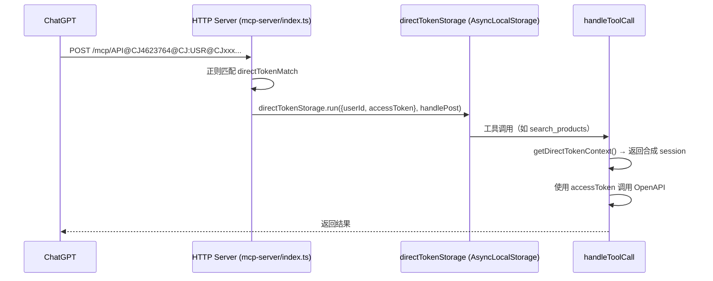
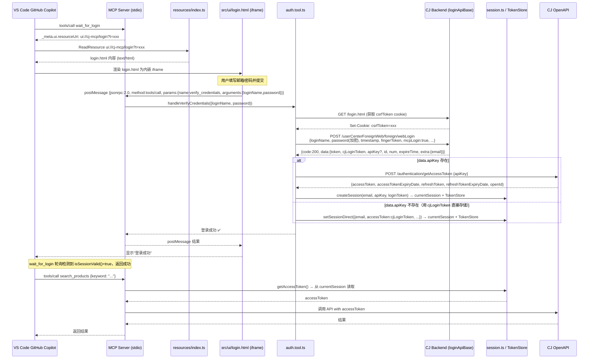

# 支持多种登录方式 — 执行计划

> 制定时间：26年05月22日 11:31:06  
> 提交人：东咸  
> 需求来源：`docs/MCP-App前端接口和API整合/支持多种登录方式-提示词.md` 第1次提交  
> 参考文档：`docs/MCP-App前端接口和API整合/提示词.md` 26年05月15日 10:56:55 第23次提交（第7次补充需求）

---

## 一、现有调用链路分析

### 1.1 登录模式总览

目前项目共支持以下三种认证模式，本次需确保前两种不受影响，并完善第三种：

| 模式 | transport | 入口 | 认证来源 | 状态 |
|------|-----------|------|----------|------|
| **直接 Token（ChatGPT）** | HTTP | `/mcp/API@{userId}@CJ:{token}` | URL 路径中内嵌 accessToken | ✅ 已正常，**不得改动** |
| **apiKey URL 模式** | HTTP | `/mcp/{apiKey}` | URL 路径 apiKey → `getAccessToken` | ✅ 已正常，**不得改动** |
| **本地 VS Code Copilot UI 登录** | stdio | `wait_for_login` → `login.html` | 用户在 UI 填写邮箱/密码 → `webLogin` | ⚠️ 需完善 |

---

### 1.2 模式一：直接 Token 模式（ChatGPT，**不得改动**）

**触发条件**：URL 路径匹配 `/mcp/API@{userId}@CJ:{accessToken}`



**关键代码位置**：
- `src/mcp-server/index.ts` — `directTokenMatch` 正则匹配 + `directTokenStorage.run()`
- `src/auth/api-key-context.ts` — `getDirectTokenContext()`
- `src/auth/session.ts` — `getSession()` 内 `getDirectTokenContext()` 分支（返回合成 session）

**隔离保证**：`directTokenStorage` 是 `AsyncLocalStorage`，仅在当次请求链路生效，不写入 `currentSession` / 持久化文件，完全与 stdio 本地会话隔离。

---

### 1.3 模式三：本地 VS Code Copilot UI 登录（**待完善**）

**触发条件**：`stdio` transport 启动 + GitHub Copilot 调用 `wait_for_login`



---

## 二、数据结构变更规划

### 2.1 `webLogin` 请求接口完整规范

**接口地址**：`POST {loginApiBase}/userCenterForeignWeb/foreign/webLogin`

**请求 Headers**（参考 23次提交 curl 完整信息）：

```
Content-Type: application/json;charset=UTF-8
Accept: application/json, text/plain, */*
Accept-Language: zh-CN,zh;q=0.9
Connection: keep-alive
User-Agent: Mozilla/5.0 (Windows NT 10.0; Win64; x64) AppleWebKit/537.36 (KHTML, like Gecko) Chrome/147.0.0.0 Safari/537.36
Origin: {loginApiBase}
Referer: {loginApiBase}/login.html?type=quickly
Cookie: {csrfToken cookie + 其他 cookies}
platform: 2
cj-area: 000000
token: (空字符串)
```

**请求 Body**：

```typescript
interface WebLoginRequest {
  loginName: string;          // 邮箱或用户名
  password: string;           // md5(md5(password) + '' + fingerToken + timestamp)
  timestamp: number;          // Date.now()
  newEncryptVersion: true;    // 固定 true
  toUser: false;              // 固定 false
  facebookId: '';             // 固定空字符串
  googleId: '';               // 固定空字符串
  appleId: '';                // 固定空字符串
  fingerToken: string;        // md5(String(timestamp) + loginName)
  mcpLogin: true;             // MCP 场景标识，固定 true
}
```

**密码加密规则**（参考 cj-web-egg/mycj/src/provider/commonjs/login.js）：
```
fingerToken = md5(timestamp + loginName)
password    = md5(md5(原始密码) + '' + fingerToken + timestamp)
```

### 2.2 `webLogin` 响应接口完整规范

**当前 TypeScript 类型定义（不完整，需补充）**：

```typescript
// 现有（不完整）
interface WebLoginResponseData {
  apiKey?: string;
  token?: string;
  cjLoginToken?: string;
  userId?: string;
  email?: string;
  nickName?: string;
}

// 补充后（完整）
interface WebLoginResponseData {
  /** CJ 前端 JWT（USR@CJxxx@L5@CJ:... 格式），用于前端 API 调用 */
  token?: string;
  /** 同 token，cjLoginToken 格式 */
  cjLoginToken?: string;
  /** OpenAPI apiKey（并非所有账号都返回此字段） */
  apiKey?: string;
  /** 用户 ID（数字），即 openId */
  id?: number;
  /** CJ 号（数字格式的用户编号） */
  num?: number;
  /** token 过期时间（毫秒时间戳） */
  expireTime?: number;
  /** 用户账号信息（嵌套对象） */
  extra?: {
    email?: string;
    nickName?: string;
    headImg?: string;
    [key: string]: unknown;
  };
  /** 兼容字段 */
  email?: string;
  userId?: string;
  nickName?: string;
}
```

### 2.3 token 类型说明与使用策略

| token 类型 | 来源 | 格式 | 用于 |
|-----------|------|------|------|
| **CJ 前端 JWT** | `webLogin` → `data.token` / `data.cjLoginToken` | `USR@CJxxx@L5@CJ:...` | CJ 前端 API（非 OpenAPI） |
| **OpenAPI accessToken** | `getAccessToken` → `data.accessToken` | UUID/JWT 格式 | OpenAPI 接口（product/listV2 等） |

**处理策略**：
1. `webLogin` 返回 `data.apiKey` → 调用 `getAccessToken(apiKey)` → 存储 OpenAPI accessToken
2. `webLogin` 无 `data.apiKey` 但有 `data.token`/`data.cjLoginToken` → 直接存储 loginToken 作为 accessToken（当前实现，需验证是否能调 OpenAPI）
3. `webLogin` 无任何 token → 提示用户前往 CJ 后台生成 apiKey

### 2.4 会话存储变更

**需更新的字段**（当前 `setSessionDirect` 硬编码 14 天过期）：

```typescript
// 当前（需修正）
accessTokenExpiry: new Date(Date.now() + 14 * 24 * 60 * 60 * 1000).toISOString()

// 改为使用实际返回值
accessTokenExpiry: loginData.data?.expireTime
  ? new Date(loginData.data.expireTime).toISOString()
  : new Date(Date.now() + 7 * 24 * 60 * 60 * 1000).toISOString()
```

---

## 三、功能点落地方案

### 任务 1：补充 webLogin 响应 TypeScript 类型定义

- [ ] **改动文件**：`src/mcp-server/tools/auth.tool.ts`
- [ ] **改动方法**：`handleVerifyCredentials()` 内部 `loginData` 类型声明
- [ ] **改动内容**：补充 `id`, `num`, `expireTime`, `extra.email` 字段类型
- [ ] **改动影响**：仅类型安全改进，不影响运行时行为
- [ ] **代码位置**：约第 520 行的 `const loginData = await loginResponse.json() as {...}`

### 任务 2：修正 expireTime 使用实际过期时间

- [ ] **改动文件**：`src/mcp-server/tools/auth.tool.ts`
- [ ] **改动方法**：`handleVerifyCredentials()` 内 `setSessionDirect()` 调用
- [ ] **改动内容**：
  - 从 `data.expireTime` 读取实际过期时间（毫秒时间戳）
  - 若 `expireTime` 不存在，默认 7 天（降低 14 天风险）
- [ ] **改动影响**：token 过期检测更准确，`isAccessTokenExpired()` 不再误报
- [ ] **代码位置**：约第 580 行的 `accessTokenExpiry` 赋值

### 任务 3：修正 userEmail 字段提取（extra.email 优先）

- [ ] **改动文件**：`src/mcp-server/tools/auth.tool.ts`
- [ ] **改动方法**：`handleVerifyCredentials()` 内 `userEmail` 变量提取
- [ ] **改动内容**：
  ```typescript
  // 现有（访问方式繁琐，类型不安全）
  const userEmail = (loginData.data as Record<string, unknown>)?.extra
    ? ((loginData.data as Record<string, unknown>).extra as Record<string, unknown>)?.email as string
    : loginData.data?.email;
  
  // 改为（完整类型后直接访问）
  const userEmail = loginData.data?.extra?.email || loginData.data?.email;
  ```
- [ ] **改动影响**：代码更简洁，提取到真实邮箱更稳定
- [ ] **代码位置**：约第 565 行

### 任务 4：补充 openId 提取（data.id）

- [ ] **改动文件**：`src/mcp-server/tools/auth.tool.ts`
- [ ] **改动方法**：`handleVerifyCredentials()` 内 `setSessionDirect()` 调用中的 `openId`
- [ ] **改动内容**：
  ```typescript
  // 现有（类型不安全，使用 type casting）
  openId: String((loginData.data as Record<string, unknown>)?.id || ''),
  
  // 改为（完整类型后直接访问）
  openId: String(loginData.data?.id || ''),
  ```
- [ ] **改动位置**：约第 590 行

### 任务 5：补充 login.html 成功后的关闭/提示逻辑

- [ ] **改动文件**：`src/ui/login.html`
- [ ] **改动内容**：
  - 登录成功后额外显示 CJ 号（`data.num`）信息
  - 当服务器返回 code:803（mcpLogin 未开通）时，显示具体提示信息
  - 登录成功后自动关闭 iframe（可选，依赖 VS Code Copilot 支持）
- [ ] **改动位置**：`login.html` 内的 `.then()` 结果处理块

### 任务 6：验证 wait_for_login 轮询在 stdio 模式下的完整流程

- [ ] **验证内容**：
  1. `wait_for_login` 调用后 `_meta.ui.resourceUri` 是否正常触发 VS Code Copilot 渲染 iframe
  2. `login.html` 的 `postMessage` 是否被 MCP Server stdio 正确接收
  3. 登录成功后 `isSessionValid()` 是否返回 true，`wait_for_login` 轮询是否能退出
  4. 退出后后续工具调用是否能正确获取 `accessToken`
- [ ] **验证方式**：本地启动 `npm run dev` + VS Code 配置 stdio MCP + 手动测试

---

## 四、测试与验收标准

### 4.1 测试文件

| 文件 | 测试内容 |
|------|---------|
| `tests/unit/auth-tool.test.ts` | verify_credentials token 处理逻辑（mock webLogin 响应） |
| 手动 E2E | VS Code Copilot stdio 模式完整登录流程 |

### 4.2 单元测试用例

```typescript
describe('handleVerifyCredentials - webLogin response handling', () => {
  it('应正确从 data.apiKey 走 getAccessToken 流程，存储 OpenAPI accessToken', async () => { /* ... */ });
  it('应从 data.expireTime 设置正确的 accessTokenExpiry', async () => { /* ... */ });
  it('应从 data.extra.email 正确提取用户邮箱', async () => { /* ... */ });
  it('应从 data.id 正确提取 openId', async () => { /* ... */ });
  it('无 apiKey 时应将 cjLoginToken 作为 accessToken 存入 session', async () => { /* ... */ });
  it('code:803 时应返回明确错误，不触发 wait_for_login 打开新窗口', async () => { /* ... */ });
});
```

### 4.3 E2E 手动验收清单

| 测试项 | 验收条件 | 模式 |
|--------|---------|------|
| wait_for_login 弹出 login.html | VS Code Copilot 对话中看到登录 UI iframe | stdio |
| 邮箱/密码登录成功 | 显示"✅ 登录成功"，显示 CJ 号 | stdio |
| 登录后调用 search_products | 返回商品列表，非"未登录"错误 | stdio |
| 登录后调用 check_login_status | 显示已登录+token 有效期（使用实际 expireTime） | stdio |
| 登出后重新登录 | logout → 再次 wait_for_login → 重新填写成功 | stdio |
| ChatGPT directToken 模式不受影响 | `/mcp/API@xxx@CJ:token` 调用正常 | HTTP |
| apiKey URL 模式不受影响 | `/mcp/{apiKey}` 自动认证正常 | HTTP |

### 4.4 不应改变的行为（回归保护）

- `getDirectTokenContext()` 分支在 `getSession()` 中优先级最高，不受本次改动影响
- `apiKeyStorage.run()` 上下文隔离不受本次改动影响
- `currentSession` 仅在 stdio 模式（无 apiKey/directToken 上下文）时读写
- `TokenStore` 持久化文件路径和格式不变

---

## 五、文件改动清单

| 文件 | 改动类型 | 任务编号 |
|------|---------|---------|
| `src/mcp-server/tools/auth.tool.ts` | 修改（类型定义 + token 提取逻辑） | 任务1-4 |
| `src/ui/login.html` | 修改（登录成功后展示 CJ 号 + code:803 处理） | 任务5 |
| `tests/unit/auth-tool.test.ts` | 修改（新增测试用例） | 任务1-4 的 TDD |

**不改动文件**（保持稳定）：
- `src/mcp-server/index.ts`（HTTP/stdio transport 路由逻辑）
- `src/auth/api-key-context.ts`（AsyncLocalStorage 隔离机制）
- `src/auth/session.ts`（session 路由逻辑）
- `src/config/env.ts`（环境配置）

---

## 六、风险评估

| 风险 | 影响级别 | 处理方式 |
|------|---------|---------|
| `webLogin` 在线上返回 `mcpLogin=true` 被拒绝（code:803） | 中 | 在 `handleVerifyCredentials` 中针对 code:803 给出明确提示，说明账号需要开通 mcpLogin 权限 |
| CJ 前端 JWT 无法用于 OpenAPI 接口 | 高 | 优先走 apiKey → `getAccessToken` 流程；无 apiKey 时用 loginToken 调 OpenAPI，若返回 401 则提示用户生成 apiKey |
| `expireTime` 字段不存在（后端版本差异） | 低 | fallback 到默认 7 天 |
| `directToken` 模式被误改动 | 高 | 本次**只修改** `auth.tool.ts` 的响应处理，不动 `index.ts` 路由和 `api-key-context.ts` |
